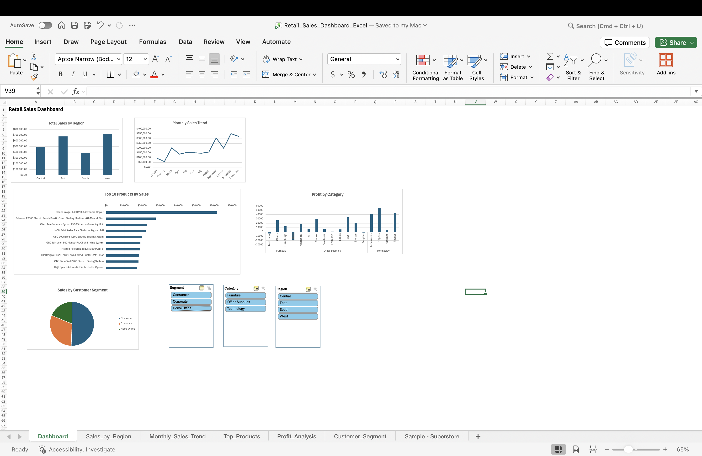

# Retail_Sales_Dashboard_Excel
📊 Retail Sales Dashboard Analysis using Excel

📌 Project Overview

This project focuses on analyzing retail sales data using Microsoft Excel to generate business insights and build an interactive sales dashboard.

The dashboard was created using Pivot Tables, Pivot Charts, Excel formulas, and Slicers to analyze sales performance, profitability, customer segments, and product trends.

The goal of this project was to simulate a real-world Data Analyst workflow, including data cleaning, transformation, analysis, visualization, and dashboard building.

🎯 Objectives

The objectives of this project include:

* Analyze regional sales performance
* Identify monthly sales trends
* Discover top-performing products
* Evaluate profitability by category and sub-category
* Analyze customer purchasing segments
* Build an interactive dashboard with dynamic filters

🛠️ Tools & Skills Used

Tools

* Microsoft Excel

Skills Applied

* Data Cleaning
* Data Transformation
* Pivot Tables
* Pivot Charts
* Excel Formulas
* Data Visualization
* Dashboard Design
* Business Analysis
* Interactive Filtering using Slicers

📂 Dataset Information

The dataset contains retail sales information including:

* Order Details
* Sales
* Profit
* Region
* Product Category
* Sub-Category
* Customer Segment
* Order Date

📈 Dashboard Features

The interactive dashboard includes:

✅ Total Sales by Region
✅ Monthly Sales Trend Analysis
✅ Top 10 Products by Sales
✅ Profit Analysis by Category & Sub-Category
✅ Customer Segment Analysis
✅ Interactive Slicers (Region, Category, Segment)

Users can dynamically filter the dashboard to analyze sales and profitability across multiple dimensions.

🔍 Key Business Insights

🌍 Regional Sales Performance

* West Region generated the highest sales.
* South Region recorded the lowest sales.

📅 Monthly Sales Trend

* November showed the highest sales performance.
* Strong sales growth was observed during Q4 (September–December).

🏆 Product Performance

* Canon imageCLASS 2200 Advanced Copier was identified as the top-selling product.

💰 Profitability Analysis

* Technology generated the highest profit.
* Tables and Bookcases were identified as loss-making sub-categories, suggesting pricing or discount inefficiencies.

👥 Customer Segment Analysis

* The Consumer segment contributed the highest share of sales.

📊 Dashboard Preview

Add your dashboard screenshot here.

Example:

🚀 Project Outcome

This project strengthened practical Excel and Data Analysis skills by applying data cleaning, business analysis, and dashboard design techniques to a real-world retail sales dataset.

👤 Author

Siri Chandana Chiriboyina
Aspiring Data Analyst | SQL | Excel | Python | Power BI

